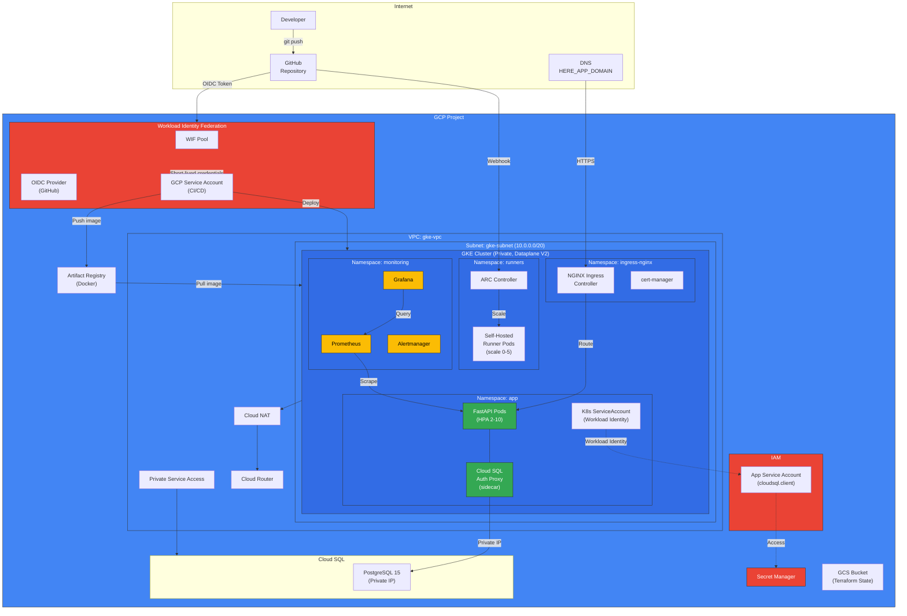
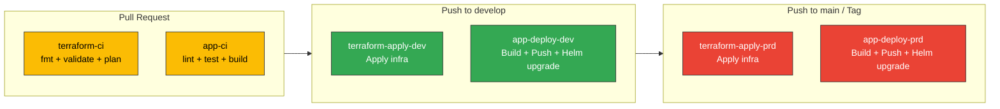

# Infrastructure Architecture Diagram

## Main Architecture



## CI/CD Pipeline Flow



## GitFlow Branching Strategy

```mermaid
gitgraph
    commit id: "init"
    branch develop
    checkout develop
    commit id: "infra-setup"
    branch feature/vpc
    checkout feature/vpc
    commit id: "add-vpc-module"
    checkout develop
    merge feature/vpc
    branch feature/gke
    checkout feature/gke
    commit id: "add-gke-module"
    checkout develop
    merge feature/gke
    branch feature/app
    checkout feature/app
    commit id: "add-fastapi-app"
    commit id: "add-helm-chart"
    checkout develop
    merge feature/app
    checkout main
    merge develop tag: "v1.0.0"
    checkout develop
    branch feature/monitoring
    checkout feature/monitoring
    commit id: "add-monitoring"
    checkout develop
    merge feature/monitoring
    checkout main
    merge develop tag: "v1.1.0"
```
